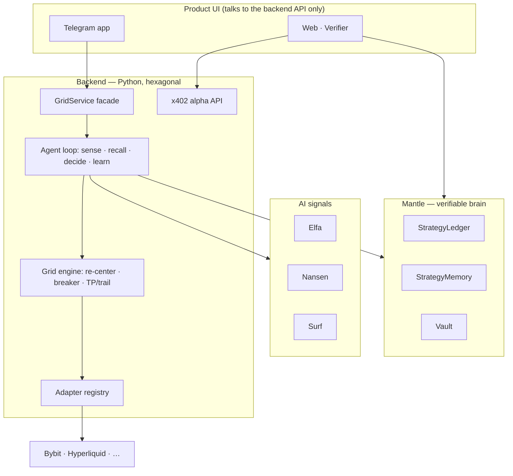

# Perps Agent

**A verifiable, self-improving AI grid-trading agent — run it from Telegram.**
It executes on the venue (live on **Bybit**); it senses, learns, and **proves its
track record on Mantle**. Don't trust, verify — every result is an on-chain record.

🌐 **[perpsagent.xyz](https://perpsagent.xyz) — waitlist open** · 𝕏 [@perpsagent](https://x.com/perpsagent)

> A real product, in active development. Born at the Mantle **AI Awakening** hackathon
> (AI · Trading & Strategy / BGA), now building toward multi-venue launch.

---

## Why Perps Agent

CEX trading bots are black boxes: their track records are unverifiable and they throw
away their own decision history. Perps Agent flips that.

- **🔍 Verifiable, not promised.** Every episode commits its strategy *before* trading
  and attests the *verified outcome* after, on Mantle. A trustless, public track record
  anyone can recompute — params can't be fitted to results after the fact.
- **🧠 Self-improving.** That same on-chain history is the agent's memory: it recalls the
  best-performing parameters for the current market regime, across its own runs *and* the
  public population. It gets better in the open.
- **📡 AI-fused signals.** Each launch reads a live regime fingerprint — volatility &
  microstructure, smart-money flows, and social momentum — before sizing a single order.
- **🔑 Non-custodial.** Your venue API keys, your account. Capital never leaves the
  exchange; the on-chain Vault never bridges to it.
- **📱 A product, not a script.** A polished Telegram app: one-screen dashboard, one-tap
  strategies, live positions, and on-chain proofs you can tap.

## The product (Telegram)

| | |
|---|---|
| **One-screen home** | balance, open positions, MNT wallet, and every action as a button |
| **One-tap strategies** | pick a coin → 🛡 Safe / ⚖️ Balanced / 🔥 Aggressive → choose how much margin → launch. Size is auto-computed from your balance; you preview the exact notional before you commit |
| **Live Bybit positions** | side · size · entry → mark · unrealized PnL, with one-tap close |
| **Grid management** | name a grid, open it for detail/edit, pause/stop — each grid independent |
| **Tap-to-configure** | tune leverage, range, take-profit, trailing, guards by tapping presets — no commands to memorize |
| **On-chain proofs in chat** | ⛓ commit / attest links to [mantlescan](https://sepolia.mantlescan.xyz) on every launch & close |

## The strategy: adaptive grid

A maker-only geometric grid that adapts instead of sitting static:

- **Dynamic re-center** — a supervisor follows price; when it leaves the band the grid is
  re-laid around the new mid. Inventory-aware: never averages up a long (or down a short).
- **Circuit breaker** — inventory & drawdown caps; on breach it cancels all and flattens.
- **Take-profit / trailing-stop** — rides a favorable move, then banks when PnL retraces.
- **Signed-position accounting** — tracks net long *and* short; guards act on the real position.

Optimization target is **risk-adjusted** performance, never raw PnL.

## The verifiable learning loop

```
SENSE → RECALL → COMMIT → EXECUTE → ATTEST → LEARN
  │        │        │         │         │        └─ next RECALL is better
  │        │        │         │         └─ verified outcome + fills root → Mantle
  │        │        │         └─ maker-only grid on the venue (Bybit)
  │        │        └─ config hash on-chain, BEFORE any trade
  │        └─ best verified params for this regime, from Mantle
  └─ fuse the regime: vol/funding/microstructure + smart-money + social
```

| Layer | Role |
|---|---|
| **Bybit v5** | primary execution venue — non-custodial, your keys |
| **Elfa** | real-time social / mention momentum |
| **Nansen** | smart-money net flows |
| **Surf** | market microstructure (vol, funding, RSI) |
| **StrategyLedger** (Mantle) | commit config hash before trading; attest the verified outcome |
| **StrategyMemory** (Mantle) | append-only `regime → params → outcome`; read back by recall |
| **Vault** (Mantle) | performance bond + on-chain fee settlement |

### Live on Mantle Sepolia (chainId 5003)

| Contract | Proxy |
|---|---|
| StrategyLedger | [`0x128E925828952803E05157Ee4fEf54ac47cf1C88`](https://sepolia.mantlescan.xyz/address/0x128E925828952803E05157Ee4fEf54ac47cf1C88) |
| StrategyMemory | [`0xC26E112437e5B6d739232732c665a64eb14Dc519`](https://sepolia.mantlescan.xyz/address/0xC26E112437e5B6d739232732c665a64eb14Dc519) |
| Vault | [`0x630370DC3a666c9b6816D5C9E8a3757242603eF3`](https://sepolia.mantlescan.xyz/address/0x630370DC3a666c9b6816D5C9E8a3757242603eF3) |

## Monetization

Charge for the **system**, not for PnL:

- **Builder fee** — a small fee per closed episode, settled on-chain in native MNT.
- **x402 alpha API** — pay-per-call access to verified `StrategyMemory` (HTTP 402 →
  pay → 200), so other agents can buy the brain. No subscription; settles on-chain.

## Roadmap — one engine, every venue

Every exchange is one `ExchangePort` adapter; the engine and agent never change. That
modularity is the roadmap:

**Live:** Bybit  ·  **Coming soon:** Hyperliquid · Extended · Lighter · Aster · Polymarket

On-chain execution (a spot grid on iZiSwap / Mantle) runs through the same engine today.

## Architecture



The UI **never** imports the engine, adapters, or any exchange/chain SDK — it talks to
the backend only through the typed `GridService` seam.

## Monorepo

| Path | Role |
|---|---|
| `contracts/` | Mantle Solidity (Foundry): StrategyLedger · StrategyMemory · Vault |
| `backend/` | Python engine + agent + `GridService` + HTTP/alpha APIs |
| `frontend/telegram/` | aiogram bot — the product UI |
| `frontend/web/` | landing + public Verifier page |
| `deploy/` | one-command VPS deploy (systemd + Postgres) |

## Quickstart

```bash
cd backend
python3.11 -m venv .venv && . .venv/bin/activate
pip install -e ".[dev,bybit]"
pytest                                     # full suite, offline, no keys
python -m perpsagent.runner --mode dry     # the whole loop on fakes
```

- Run it live & host it: [`deploy/README.md`](deploy/README.md) · [`DEPLOY.md`](DEPLOY.md)
- Strategy & the learning loop: [`docs/CONCEPT.md`](docs/CONCEPT.md)
- Backend APIs & runner flags: [`backend/README.md`](backend/README.md)

## Safety

- **Testnet by default** — the config guard refuses env↔venue mismatches in both
  directions; trading real money is an explicit opt-in.
- **Commit on-chain before trading**, attest the verified outcome after.
- **Maker-only** grids; taker only on emergency flatten. Circuit breaker + profit guard
  run on every fill and tick. Fills survive WebSocket gaps and process restarts.
- **Non-custodial** — your keys, your account; the Vault never bridges to the venue.
