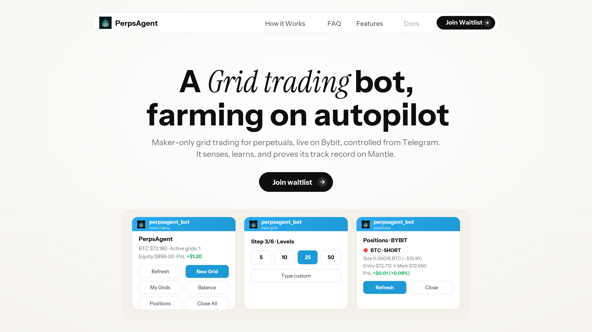
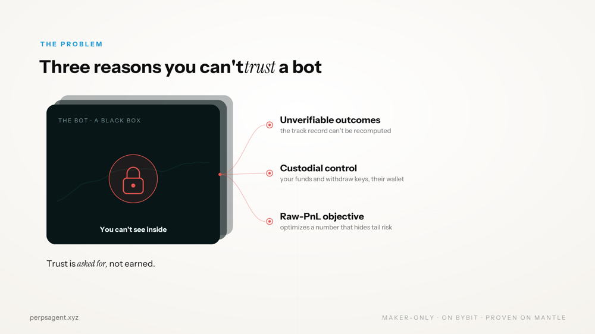
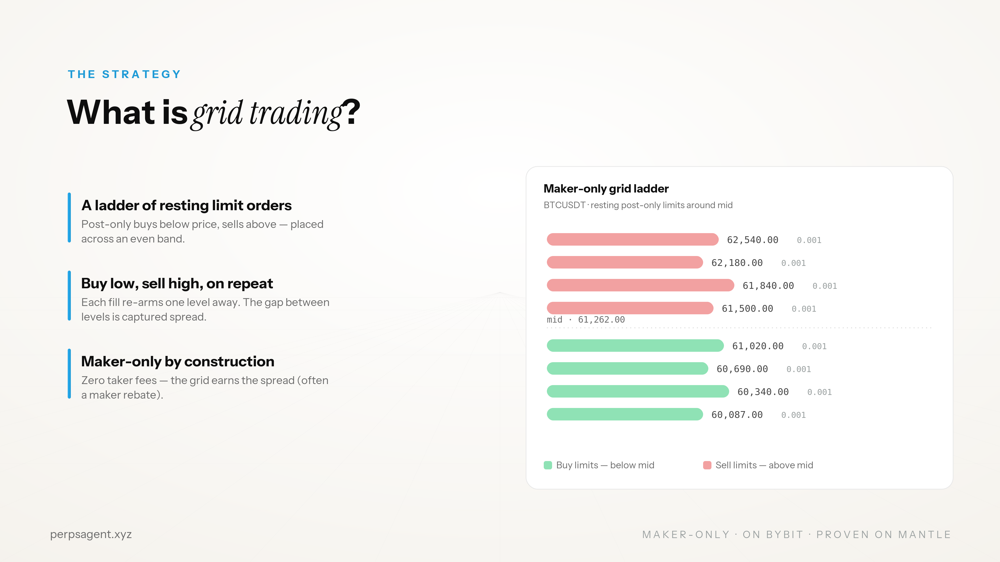
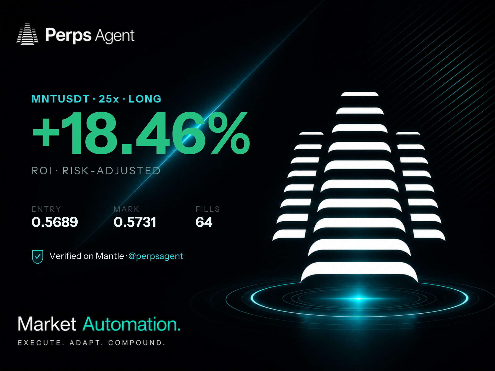
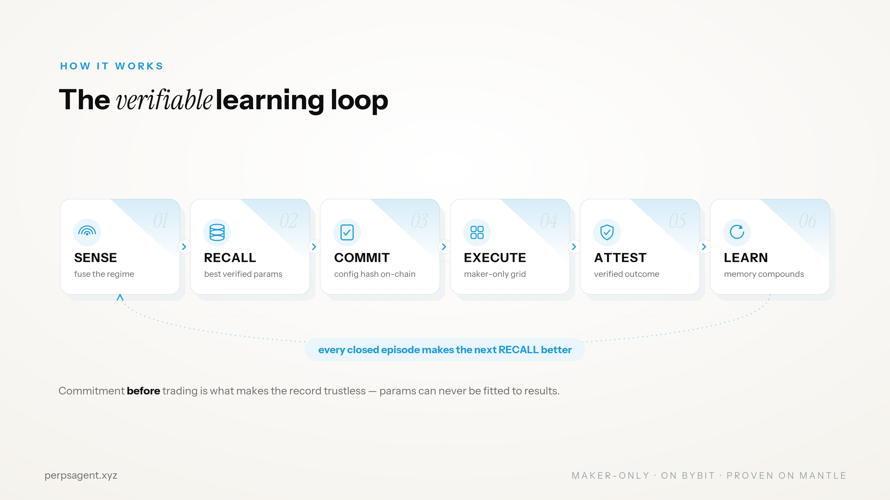
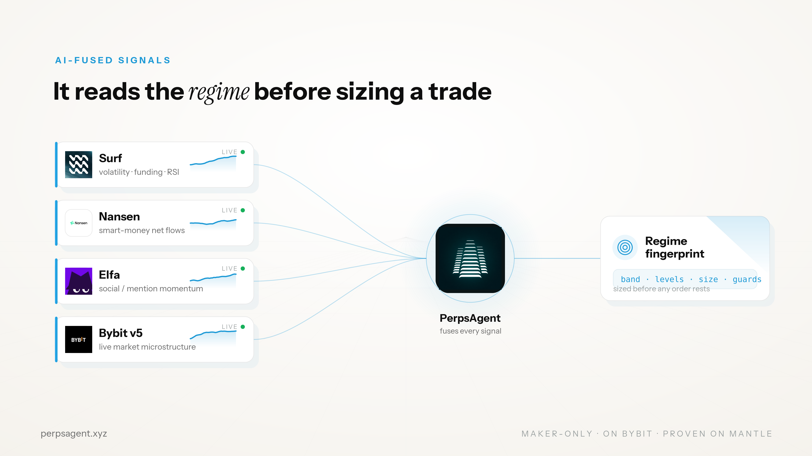
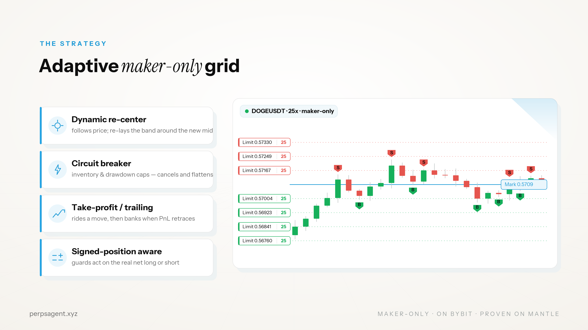
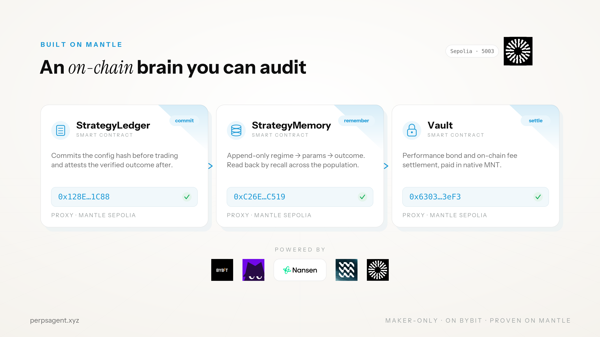

<p align="center">
  
</p>

<p align="center">
  <b>A verifiable, self-improving grid trading agent. Live on Bybit, run from Telegram, proven on Mantle.</b>
</p>

<p align="center">
  <a href="https://perpsagent.xyz"><b>Website</b></a>
  &nbsp;|&nbsp;
  <a href="https://docs.perpsagent.xyz"><b>Docs</b></a>
  &nbsp;|&nbsp;
  <a href="https://youtu.be/0Vubbfn32_c"><b>Demo</b></a>
  &nbsp;|&nbsp;
  <a href="https://docs.google.com/presentation/d/1aGbb-JPlc4B1iTZ4cBTffXJDkangvEEqT0zNALIa0bE/edit?usp=sharing"><b>Pitch deck</b></a>
  &nbsp;|&nbsp;
  <a href="https://x.com/perpsagent"><b>X</b></a>
</p>

---

Perps Agent is a real product in active development, not a hackathon demo. It is live on Bybit today, its smart contracts are deployed on Mantle, and its waitlist is open at [perpsagent.xyz](https://perpsagent.xyz).

## The problem

Every CEX trading bot is a black box.

Track records are screenshots, not proof. Parameters get quietly tuned to fit past results, and the bot throws away the decision history that produced them. A user staring at "+300% backtest" has no way to tell a real edge from a lucky seed, and no way to verify anything once money is on the line.

There is also no shared memory. Each bot relearns the same lessons in private, so nothing compounds. The industry sells outcomes it cannot prove and intelligence it cannot accumulate.



## The solution

Perps Agent makes the bot prove itself.

It is a maker-only grid trading agent operated entirely from Telegram. Before any trade it commits its exact strategy to Mantle. After the episode closes it attests the verified outcome on chain. What comes out is a public track record anyone can recompute, and an on-chain memory the agent reads back to get better over time.



What a user actually gets:

- One-tap strategies. Pick a coin, choose Safe, Balanced or Aggressive, set your margin, launch. Size is computed from your balance and previewed before you commit.
- Live positions and grids. Side, size, entry to mark, unrealized PnL, with one-tap close. Each grid is independent.
- A shareable PnL card. Every close, and any open position, renders a clean PnL image you can post.
- Proofs in chat. Every launch and close links to the on-chain commit and attest records.
- Non-custodial by design. Your Bybit API keys, your account. Capital never leaves the exchange.



## What makes it different

Three things separate Perps Agent from a normal grid bot.

**Verifiable by commitment.** The strategy hash goes on chain before the first order, so parameters can never be fitted to results after the fact. That is the difference between a claim and a proof.



**Self-improving memory.** Every closed episode writes its regime, parameters and outcome to an append-only contract. On the next launch the agent recalls the best verified parameters for the current market regime, across its own history and the public population. The same record is both the audit proof and the next training example.

**AI-fused signals.** Before sizing a single order, the agent reads a live regime fingerprint from Elfa for social momentum, Nansen for smart-money flows, and Surf for volatility and microstructure. It never trades blind, and it leans with a trend instead of fighting it.



## The strategy: an adaptive grid

The strategy is a maker-only geometric grid that adapts instead of sitting static.

- Regime-aware bias. The agent reads the trend and biases the grid with it, and vetoes a lean that would enter at a range extreme.
- Dynamic re-center. A supervisor follows price and re-lays the grid around the new mid when price leaves the band.
- Circuit breaker. Inventory and drawdown caps. On a breach it cancels every order and flattens.
- Take-profit and trailing stop. It rides a favorable move, then banks the gain when PnL retraces.
- Signed-position accounting. It tracks net long and short, and the guards act on the real position.

The optimization target is risk-adjusted performance, never raw PnL.



## Built like a startup, not a script

The architecture is the moat. The product UI never touches the engine, the adapters, or any exchange SDK. It talks to the backend through a single typed `GridService` facade. Every exchange implements one `ExchangePort` adapter, so adding a venue is one folder, and the engine and agent never change.

This is why expansion is cheap and the codebase scales to many users and many venues without a rewrite.



The verifiable learning loop, end to end:

```
SENSE     fuse the live regime from AI signals and venue candles
RECALL    pull the best verified params for this regime from Mantle
COMMIT    write the config hash on chain, before the first order
EXECUTE   run the maker-only grid on Bybit
ATTEST    write the verified outcome back to Mantle
LEARN     the next RECALL starts from a better prior
```

### Live on Mantle Sepolia (chainId 5003)

| Contract | Role | Proxy |
|---|---|---|
| StrategyLedger | Commit the config hash before trading, attest the verified outcome after | [`0x128E92...cf1C88`](https://sepolia.mantlescan.xyz/address/0x128E925828952803E05157Ee4fEf54ac47cf1C88) |
| StrategyMemory | Append-only regime, params and outcome, read back by recall | [`0xC26E11...4Dc519`](https://sepolia.mantlescan.xyz/address/0xC26E112437e5B6d739232732c665a64eb14Dc519) |
| Vault | Performance bond and on-chain fee settlement in native MNT | [`0x630370...2603eF3`](https://sepolia.mantlescan.xyz/address/0x630370DC3a666c9b6816D5C9E8a3757242603eF3) |

## Where we are now

- Live on Bybit. The full sense, recall, commit, execute, attest and learn loop runs end to end on a real venue. Preflight passes with live equity and live signals.
- Contracts deployed on Mantle. Ledger, Memory and Vault are live and wired into the backend.
- Waitlist open. The landing page and public docs are live, and users are signing up at [perpsagent.xyz](https://perpsagent.xyz).

## How we monetize

We charge for the system, not for the PnL.

- Builder fee. A small flat fee per closed episode, settled on chain in native MNT.
- x402 alpha API. Pay-per-call access to verified `StrategyMemory` over HTTP 402, so other agents can buy the brain. No subscription, and everything settles on chain.

## One engine, every venue

Every exchange is one `ExchangePort` adapter and the engine never changes, so expansion is the roadmap.

Live now: Bybit. Next: Hyperliquid, Extended, Lighter, Aster and Polymarket. On-chain execution already runs through the same engine as a spot grid on Mantle.

## Repository

| Path | Role |
|---|---|
| `contracts/` | Mantle Solidity (Foundry): StrategyLedger, StrategyMemory, Vault |
| `backend/` | Python engine, agent loop, `GridService`, HTTP and alpha APIs |
| `frontend/telegram/` | aiogram bot, the product UI |
| `frontend/web/` | landing page and public Verifier |
| `deploy/` | one-command VPS deploy on systemd and Postgres |

## Run it locally

```bash
cd backend
python3.11 -m venv .venv && . .venv/bin/activate
pip install -e ".[dev,bybit]"
pytest                                  # full suite, offline, no keys needed
python -m perpsagent.runner --mode dry  # the whole loop on fakes
```

- Host it live: [`deploy/README.md`](deploy/README.md) and [`DEPLOY.md`](DEPLOY.md)
- Strategy and the learning loop: [`docs/CONCEPT.md`](docs/CONCEPT.md)
- Backend APIs and runner flags: [`backend/README.md`](backend/README.md)
- Full documentation: [docs.perpsagent.xyz](https://docs.perpsagent.xyz)

## Safety

- Testnet by default. The config guard refuses an environment and venue mismatch in both directions, and trading real money is an explicit opt-in.
- Commit on chain before trading, attest the verified outcome after.
- Maker-only grids, with taker orders only on an emergency flatten. The circuit breaker and profit guard run on every fill and tick. Fills survive WebSocket gaps and process restarts.
- Non-custodial. Your keys and your account, and the Vault never bridges to the venue.

## Team

Built by Team PerpsAgent.

- Yeheskiel Yunus Tame, [@YeheskielTame](https://x.com/YeheskielTame)
- Bima Jadiva, [@BimaJadiva07](https://x.com/BimaJadiva07)

## Links

- Website and waitlist: [perpsagent.xyz](https://perpsagent.xyz)
- Documentation: [docs.perpsagent.xyz](https://docs.perpsagent.xyz)
- Demo video: [youtu.be/0Vubbfn32_c](https://youtu.be/0Vubbfn32_c)
- Pitch deck: [Google Slides](https://docs.google.com/presentation/d/1aGbb-JPlc4B1iTZ4cBTffXJDkangvEEqT0zNALIa0bE/edit?usp=sharing)
- X: [@perpsagent](https://x.com/perpsagent)

Track: Mantle AI Awakening, AI Trading and Strategy, BGA.
</content>
