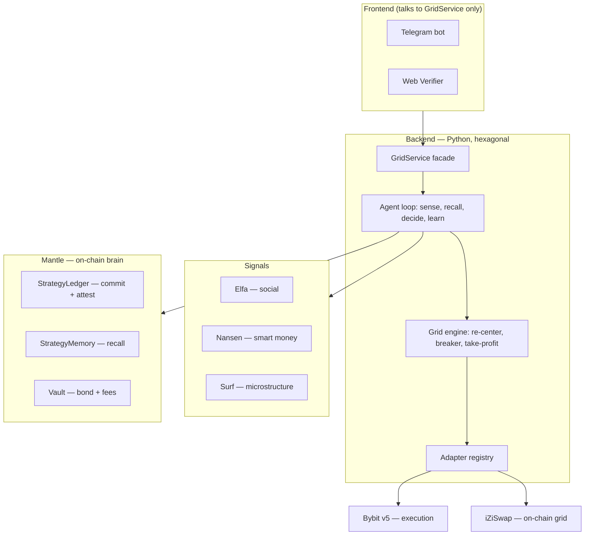

# Perps Agent

A verifiable, self-improving grid-trading agent. It executes on Bybit, and commits,
learns, and proves on Mantle. X: [@perpsagent](https://x.com/perpsagent).

Built for the Mantle Turing Test Hackathon 2026 — AI · Trading & Strategy (BGA) track.

## Architecture



## Monorepo

| Path | Role |
|------|------|
| `contracts/` | Mantle Solidity (Foundry): StrategyLedger, StrategyMemory, Vault |
| `backend/` | Python engine + agent + the `GridService` facade |
| `frontend/telegram/` | aiogram bot — product UI |
| `frontend/web/` | public Verifier page — recompute equity from chain |
| `docs/`, `plan/` | concept/strategy, status |

The one cross-team rule: the UI never imports the engine, adapters, or any
exchange/chain SDK. It talks to the typed `GridService` facade only.

## Quickstart

```bash
cd backend
python3.11 -m venv .venv && . .venv/bin/activate
pip install -e ".[dev,bybit]"
pytest                                              # 56 tests
python -m perpsagent.runner --mode dry              # full loop on fakes, no keys

# live (testnet): fill backend/.env, then
python -m perpsagent.runner --mode live --venue bybit --market BTCUSDT \
  --leverage 1 --band 0.012 --order-size 0.005 \
  --recenter-interval 20 --max-inventory 0.05 --trail 0.3 --trail-arm 10
```

- Strategy + the learning loop: [`docs/CONCEPT.md`](docs/CONCEPT.md)
- Backend, `GridService` API, runner flags: [`backend/README.md`](backend/README.md)
- Contracts: [`contracts/README.md`](contracts/README.md) · Deploy/run: [`DEPLOY.md`](DEPLOY.md)

Defaults: testnet only unless `PERPSAGENT_ENV=mainnet`; the runner refuses an
env↔RPC mismatch. Grid logic adapted from the `deltaperps` platform.
