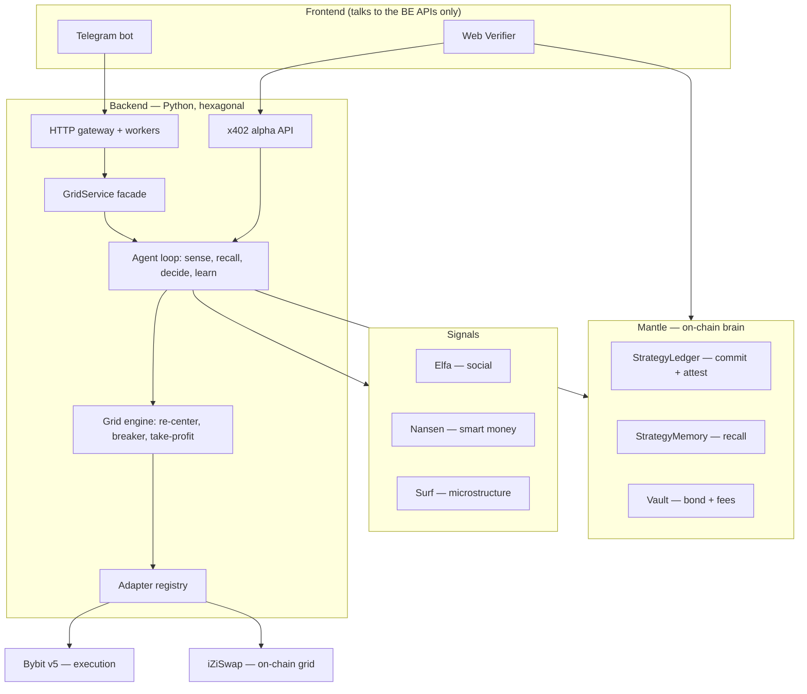

# Perps Agent

A verifiable, self-improving grid-trading agent. It executes on Bybit, and commits,
learns, and proves on Mantle. X: [@perpsagent](https://x.com/perpsagent).

Built for the Mantle Turing Test Hackathon 2026 — AI · Trading & Strategy (BGA) track.

**Status — the full loop is proven live on testnet (2026-06-10):** preflight 10/10 →
config hash committed on Mantle *before* trading → ~18 min maker-only grid on Bybit
testnet (44 fills, inventory-aware re-center) → outcome attested on-chain → the same
episode recalled back from `StrategyMemory` AND sold per-call through the x402 alpha
API ($0.01, replay-protected). Don't trust, verify — every claim has an address below.

## Deployed — Mantle Sepolia (chainId 5003)

| Contract | Role | Proxy |
|---|---|---|
| StrategyLedger | pre-commit config hash + attest verified outcomes | [`0x128E925828952803E05157Ee4fEf54ac47cf1C88`](https://sepolia.mantlescan.xyz/address/0x128E925828952803E05157Ee4fEf54ac47cf1C88) |
| StrategyMemory | append-only regime → params → outcome memory (recall) | [`0xC26E112437e5B6d739232732c665a64eb14Dc519`](https://sepolia.mantlescan.xyz/address/0xC26E112437e5B6d739232732c665a64eb14Dc519) |
| Vault | performance bond + fee settlement (never bridges to the CEX) | [`0x630370DC3a666c9b6816D5C9E8a3757242603eF3`](https://sepolia.mantlescan.xyz/address/0x630370DC3a666c9b6816D5C9E8a3757242603eF3) |

Agent/deployer: `0x176065cD234bEab173a89B299B299492bB20C006` · RPC:
`https://rpc.sepolia.mantle.xyz` · full record (incl. implementations):
[`contracts/deployments/mantle-sepolia.json`](contracts/deployments/mantle-sepolia.json).

## Architecture



## APIs — what the frontend consumes

The UI never imports the engine, adapters, or any exchange/chain SDK. Three
surfaces, all documented in [`backend/README.md`](backend/README.md):

| Surface | Transport | Use |
|---|---|---|
| Worker/Gateway HTTP API | REST + `X-User-Id` header | product UI: create/stop/pause grids, status, balance |
| `GridService` facade | in-process (typed Python) | same contract, for a bot embedded in the worker process |
| Alpha API | REST + x402 (HTTP 402 → pay → 200) | selling verified regime/recall per call |
| On-chain reads | JSON-RPC (view calls) | public Verifier page — recompute results straight from Mantle |

## Monorepo

| Path | Role |
|------|------|
| `contracts/` | Mantle Solidity (Foundry): StrategyLedger, StrategyMemory, Vault |
| `backend/` | Python engine + agent + `GridService` + HTTP/alpha APIs |
| `frontend/telegram/` | aiogram bot — product UI |
| `frontend/web/` | landing + public Verifier page |
| `docs/`, `plan/` | concept/strategy, status |

## Quickstart

```bash
cd backend
python3.11 -m venv .venv && . .venv/bin/activate
pip install -e ".[dev,bybit]"
pytest                                              # full suite, offline, no keys
python -m perpsagent.runner --mode dry              # full loop on fakes

# live (testnet): fill backend/.env, verify, then run
python scripts/preflight.py                         # PASS/FAIL matrix: Bybit, Mantle, signals
python -m perpsagent.runner --mode live --venue bybit --market BTCUSDT \
  --leverage 1 --band 0.012 --order-size 0.005 \
  --recenter-interval 20 --max-inventory 0.05 --trail 0.3 --trail-arm 10
```

- Strategy + the learning loop: [`docs/CONCEPT.md`](docs/CONCEPT.md)
- Backend APIs, `GridService`, runner flags: [`backend/README.md`](backend/README.md)
- Contracts: [`contracts/README.md`](contracts/README.md) · Deploy/run: [`DEPLOY.md`](DEPLOY.md)

## Safety defaults

- **Testnet always** unless `PERPSAGENT_ENV=mainnet`. The config guard refuses
  mismatches in *both* directions (a testnet label with real Bybit money is
  rejected, and vice versa). `PERPSAGENT_PROOFS_ON_TESTNET=true` is the explicit
  opt-in to trade real money on Bybit while keeping proofs on free Mantle Sepolia.
- Commit on-chain **before** trading; attest the verified outcome after.
- Maker-only grids; taker only on emergency flatten. Circuit breaker (inventory /
  drawdown) + profit guard (take-profit / trailing stop) on every fill and tick.
- Fills survive WebSocket gaps (REST backfill + dedup) and process restarts
  (persisted before the paired order is placed; `scripts/close_episode.py`
  finishes an interrupted episode's attest + memory write).
- Non-custodial: your Bybit keys, your account; the Vault never bridges to the CEX.
- Optimize **risk-adjusted** performance, never raw PnL.

Grid logic adapted from the `deltaperps` platform.
