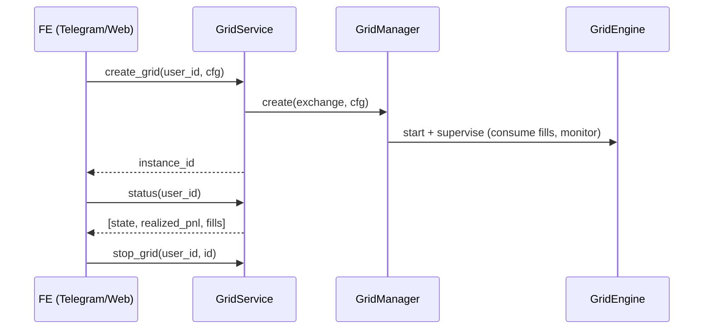

# Backend

Python engine + AI agent. Hexagonal: a pure `domain/` core, adapters behind a
registry, and the `GridService` facade. Testnet-first.

```bash
cd backend
python3.11 -m venv .venv && . .venv/bin/activate
pip install -e ".[dev,bybit]"
pytest                                   # 56 tests
python -m perpsagent.runner --mode dry   # full loop on fakes, no keys/network
```

## Layout

| Path | Role |
|------|------|
| `domain/` | pure core: models, grid math, pnl, regime, ports (no I/O) |
| `adapters/exchanges/` | venues behind one `ExchangePort` + `registry.py` (bybit, mantle_dex, fake) |
| `adapters/chain/` | Mantle client: ledger, memory, vault (web3.py) |
| `adapters/signals/` | elfa, nansen, surf — regime inputs |
| `adapters/payments/`, `adapters/store/` | x402 metering, SQLite recovery |
| `agent/` | the loop: sense, recall, decide, learn (+ explainable rationale) |
| `app/` | `GridEngine`, `GridManager`, `GridService`, `safety` |

Add a venue: one folder under `adapters/exchanges/` implementing `ExchangePort`,
plus a `registry.py` entry. The engine and agent never change.

## GridService — the BE→FE seam

The UI depends on this typed facade only (`app/service.py`), never on the engine,
adapters, or any SDK.

```
create_grid(user_id, cfg)          -> instance_id
stop_grid(user_id, instance_id)    -> None
pause_grid(user_id, instance_id)   -> None
status(user_id)                    -> [GridStatusView{instance_id, state, realized_pnl, fill_count}]
balance(user_id)                   -> BalanceView{equity, available, currency}
```



A separate HTTP endpoint (`app/alpha_api.py`) exposes verified `StrategyMemory`
queries metered with x402 (pay-per-call, settled on-chain).

## Runner flags

```
--mode dry|live   --venue bybit|mantle_dex   --market BTCUSDT
--leverage N                 enforced on the venue (set_leverage)
--band F --levels N          grid half-band fraction + level count
--order-size Q               base qty per level
--recenter-interval S        re-center supervisor cadence (0 = off)
--max-inventory Q            circuit-breaker net-position cap
--max-drawdown Q             circuit-breaker loss cap (quote)
--trail F --trail-arm Q      trailing-stop: bank after retracing F of peak PnL
--take-profit Q              bank when total PnL >= Q
```

Explicit flags override recalled params; unset ones are filled from on-chain
recall. Dry mode runs the full loop on the in-memory `FakeExchange` + `MemoryChain`.
