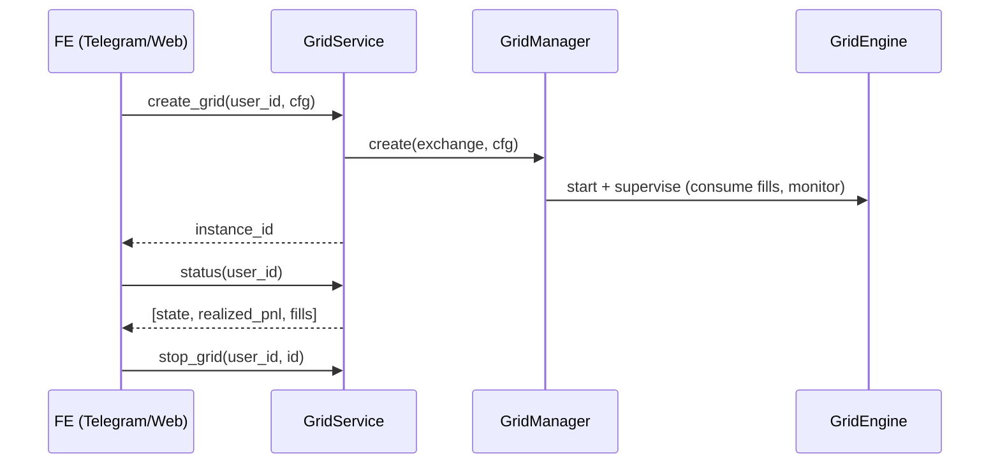

# Backend

Python engine + AI agent. Hexagonal: a pure `domain/` core, adapters behind a
registry, and three FE-facing surfaces (HTTP API, `GridService` facade, x402 alpha
API). Testnet-first.

```bash
cd backend
python3.11 -m venv .venv && . .venv/bin/activate
pip install -e ".[dev,bybit]"
pytest                                   # full suite, offline, no keys/network
python -m perpsagent.runner --mode dry   # full loop on fakes
```

## Layout

| Path | Role |
|------|------|
| `domain/` | pure core: models, grid math, pnl, regime, ports (no I/O) |
| `adapters/exchanges/` | venues behind one `ExchangePort` + `registry.py` (bybit, mantle_dex, fake) |
| `adapters/chain/` | Mantle client: ledger, memory, vault (web3.py) + nonce manager |
| `adapters/signals/` | elfa (social), nansen (smart money), surf (microstructure) |
| `adapters/payments/` | x402 gateway (402 challenge, EIP-3009 verify, settle) |
| `adapters/store/` | SQLite / Postgres persistence + encrypted per-user credentials |
| `adapters/cache/` | Redis response cache (alpha API, multi-replica) |
| `agent/` | the loop: sense, recall, decide, learn (+ explainable rationale) |
| `app/` | `GridEngine`, `GridManager`, `GridService`, `worker`, `gateway`, `alpha_api`, `safety` |

Add a venue: one folder under `adapters/exchanges/` implementing `ExchangePort`,
plus a `registry.py` entry. The engine and agent never change.

---

# API contract (FE ↔ BE)

The UI never imports the engine, adapters, or any SDK. Everything below is the
complete surface the frontend may depend on.

## 1. HTTP API — workers + gateway

The product API. One stateless **gateway** (`app/gateway.py`, default `:8080`)
routes by user to N **workers** (`app/worker.py`, one shard each, default `:9000`).
Single-node dev: call a worker directly — same endpoints.

Identity: every request carries `X-User-Id: <int>` (for the Telegram bot this is
the chat id). The header is **trusted input** — terminate auth at the gateway/ingress
before exposing the worker to untrusted clients.

| Method | Path | Body | Returns |
|---|---|---|---|
| GET | `/healthz` | — | `{"ok": true, "node": "0"}` |
| POST | `/v1/grids` | grid config (below) | `{"instance_id": "BTCUSDT-0-ab12cd34"}` |
| DELETE | `/v1/grids/{instance_id}` | — | `{"ok": true}` (cancel orders, mark CLOSED) |
| POST | `/v1/grids/{instance_id}/pause` | — | `{"ok": true}` |
| GET | `/v1/status` | — | `[{"instance_id", "state", "realized_pnl", "fill_count"}]` |
| GET | `/v1/balance` | — | `{"equity": "73191.75", "available": "...", "currency": "USDT"}` |
| GET | `/v1/market/{market}` | — | `{"market", "bid", "ask", "mid"}` — live top-of-book via the user's client |
| PUT | `/v1/credentials` | `{api_key, api_secret, testnet=true}` | `{"ok": true, "testnet": ...}` — seal the user's venue keys (testnet-first; mainnet is explicit opt-in) |
| GET | `/v1/credentials` | — | `{"connected", "testnet", "key_preview"}` or `{"connected": false}` — never echoes a secret |
| DELETE | `/v1/credentials` | — | `{"ok": true}` — forget keys + tear down the session |

Create-grid body (`POST /v1/grids`):

```json
{
  "market": "BTCUSDT",          // required
  "lower": "56000", "upper": "57100",   // band bounds — OR send "band" instead
  "band": "0.01",                // shorthand: bounds = live mid * (1 ± band)
  "levels": 10,                  // required
  "order_size": "0.001",         // base qty per level (default 0.01)
  "spacing": "geometric",        // geometric | arithmetic
  "leverage": "1",               // enforced on the venue
  "venue": "bybit"               // bybit | mantle_dex | fake
}
```

Errors: `400` malformed body / missing or non-int `X-User-Id` · `401` no stored
venue keys (call `PUT /v1/credentials` first) · `409` not your grid, or user not
owned by this shard (defense-in-depth; the gateway routes correctly) · `503`
credential endpoints without `PERPSAGENT_CRED_MASTER_KEY` configured.
States: `INITIALIZING → RUNNING ⇄ REBALANCING → EXITING/HALTED`.

```bash
curl -X POST localhost:9000/v1/grids -H 'X-User-Id: 42' -H 'Content-Type: application/json' \
  -d '{"market":"BTCUSDT","lower":"56000","upper":"57100","levels":10,"order_size":"0.001"}'
curl localhost:9000/v1/status -H 'X-User-Id: 42'
```

Multi-tenancy: one `UserSession` per user with its **own** venue client (own keys,
own private fill stream) — capital and fills are isolated per user by construction.
With `PERPSAGENT_CRED_MASTER_KEY` set, each user's Bybit keys are stored
Fernet-encrypted (SQLite by default, Postgres when `PERPSAGENT_POSTGRES_DSN` is
set) and their client is rebuilt from the sealed keys on demand; without the
master key the worker falls back to a shared demo `FakeExchange`.

## 2. `GridService` facade — in-process

Same contract as the HTTP API, as a typed Python protocol (`app/service.py`) for a
bot embedded in the worker process:

```
create_grid(user_id, cfg)          -> instance_id
stop_grid(user_id, instance_id)    -> None
pause_grid(user_id, instance_id)   -> None
status(user_id)                    -> [GridStatusView{instance_id, state, realized_pnl, fill_count}]
balance(user_id)                   -> BalanceView{equity, available, currency}
```



## 3. Alpha API — verified intelligence, metered with x402

`app/alpha_api.py` (default `:8402`) sells the agent's brain per call. Proven live:
challenge → EIP-3009 signature → verify → serve → settlement receipt; replay and
forged signatures rejected.

| Method | Path | Paid | Returns |
|---|---|---|---|
| GET | `/healthz` | no | `{"ok": true, "service": "perpsagent-alpha"}` |
| GET | `/v1/alpha/regime/{market}` | $0.01 | live fused regime fingerprint |
| GET | `/v1/alpha/recall/{market}` | $0.01 | best VERIFIED episodes for the current regime |

The x402 flow (scheme `exact`, network `mantle-sepolia`):

1. Call without payment → **HTTP 402** with `{"x402Version": 1, "accepts": [PaymentRequirements]}`
   (`maxAmountRequired`, `payTo`, `asset`, `extra: {name, version}` for the EIP-712 domain).
2. Sign an EIP-3009 `TransferWithAuthorization` (EIP-712) for `asset` → retry with
   header `X-PAYMENT: base64(PaymentPayload)`.
3. **200** + body; header `X-PAYMENT-RESPONSE: base64({success, mode, payer, transaction})`.
   Settlement modes: `facilitator` / `onchain` / `deferred` (dev default until a
   real EIP-3009 USDC is configured — see issue #29). Nonces are single-use
   (replay-protected); authorizations expire after `maxTimeoutSeconds` (300s).

Response bodies (cached `PERPSAGENT_ALPHA_CACHE_TTL_S`, Redis-shared when
`PERPSAGENT_REDIS_URL` is set):

```json
// /v1/alpha/regime/BTCUSDT
{"market": "BTCUSDT", "regime": {"realized_vol": 0.031, "trend_strength": -0.51,
 "funding_rate": 6e-06, "range_width": 0.0097, "volume_z": 0.0,
 "smart_money_flow": 0.0, "social_momentum": -0.28}}

// /v1/alpha/recall/BTCUSDT — episodes are on-chain-verified, ranked risk-adjusted
{"market": "BTCUSDT", "regime": {...}, "episodes": [
  {"config": {"market": "BTCUSDT", "lower": "56006.3790", "upper": "57137.8210",
              "levels": 10, "spacing": "geometric", "order_size": "0.001"},
   "outcome": {"realized_pnl": "0.1968", "winrate": 0.63,
               "risk_adjusted": 0.1968, "is_backtest": false},
   "regime": {...}}]}
```

## 4. On-chain reads — the Verifier page

The web Verifier recomputes results straight from Mantle Sepolia, independent of
the backend. Addresses in the table below; ABIs in
`src/perpsagent/adapters/chain/abi/*.json` (copy them to the FE).

| Contract | Address | Key views |
|---|---|---|
| StrategyLedger | `0x128E925828952803E05157Ee4fEf54ac47cf1C88` | `getCommitment(bytes32 instanceId)` → `{agent, configHash, committedAt}` · `getLatestAttestation(bytes32)` → `{realizedPnl(1e6), winrateBps, riskAdjBps, fillsRoot, attestedAt, count}` |
| StrategyMemory | `0xC26E112437e5B6d739232732c665a64eb14Dc519` | `totalRecords()` · `countByRegime(bytes32 regimeKey)` · `getByRegime(key, offset, limit≤200)` → `Record[]` |
| Vault | `0x630370DC3a666c9b6816D5C9E8a3757242603eF3` | `balanceOf(user, asset)` · `treasury()` |

`instanceId = keccak256(utf8(instance_id_string))`. `realizedPnl` is fixed-point
1e6; `winrateBps`/`riskAdjBps` are basis points. Events for indexing:
`StrategyCommitted`, `OutcomeAttested`, `MemoryWritten`.

---

## Runner flags

```
--mode dry|live   --venue bybit|mantle_dex   --market BTCUSDT
--leverage N                 enforced on the venue (set_leverage)
--band F --levels N          grid half-band fraction + level count
--order-size Q               base qty per level
--recenter-interval S        re-center supervisor cadence (0 = off)
--max-inventory Q            circuit-breaker net-position cap (0 = auto 3x grid)
--max-drawdown Q             circuit-breaker loss cap (quote)
--trail F --trail-arm Q      trailing-stop: bank after retracing F of peak PnL
--take-profit Q              bank when total PnL >= Q
```

Explicit flags override recalled params; unset ones are filled from on-chain
recall. Live mode shuts down gracefully on **SIGINT or SIGTERM** (cancel orders →
attest → write memory → drain confirmations) — safe under nohup/systemd/docker.

## Scripts

| Script | Purpose |
|---|---|
| `scripts/preflight.py` | PASS/FAIL matrix before any live run: Bybit (public+signed), Mantle RPC, 3 contracts, chain read, 3 signals |
| `scripts/close_episode.py` | finish an interrupted episode: rebuild outcome from persisted fills → attest → write memory → mark CLOSED |
| `scripts/demo_dry_run.py` | scripted full-loop demo on fakes |
| `scripts/itest_chain.py` | commit → attest → write → recall round-trip against a local anvil |

Config reference: [`.env.example`](.env.example) — every `PERPSAGENT_*` variable
with comments. The guard (`Settings.assert_consistent`) refuses env↔venue
mismatches in both directions before any money path runs.
