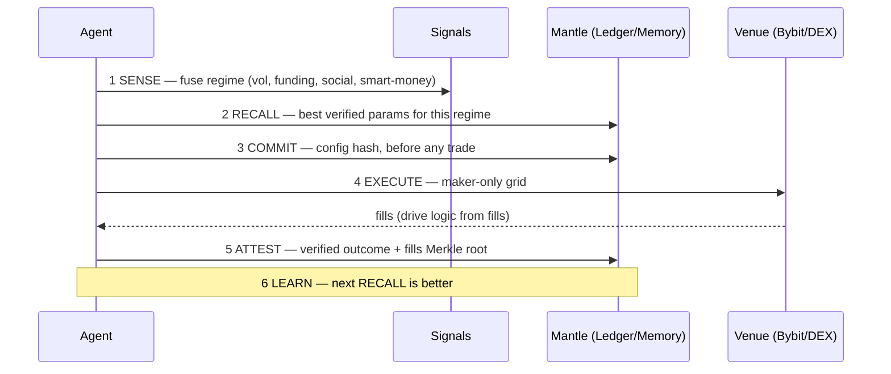

# Concept & Strategy

## Thesis

CEX trading bots are black boxes — track records are unverifiable and the bot
discards its own decision history. Perps Agent writes that history to a public,
tamper-proof memory on Mantle: every episode commits its strategy *before* trading
and attests the *verified outcome* after. The same record is read back as the
agent's experience buffer (recall best params for the current regime, across its
own runs and the public population). Verifiability is a byproduct of a system whose
job is to learn in the open. Optimization target is risk-adjusted, never raw PnL.

## The Verifiable Learning Loop

Commitment before trading is what makes the record trustless: params cannot be
fitted to results.

## Strategy: adaptive grid

A maker-only geometric grid that adapts instead of sitting static:

- **Dynamic re-center.** A supervisor follows price: when it leaves the band the
  grid is cancelled and re-laid around the new mid. Inventory-aware — never averages
  up a long (or down a short).
- **Circuit breaker.** Inventory and drawdown caps; on breach it cancels all and
  flattens.
- **Take-profit / trailing-stop.** Locks gains on a favorable move — rides up, then
  banks when PnL retraces a set fraction from its peak.
- **Signed-position accounting.** Tracks net long *and* short; guards act on the
  real position.
- **Tunable, deterministic.** `band / levels / order-size / leverage / guards` are
  per-run flags; explicit flags override recalled params.

Each closed episode writes `regime → params → outcome` (realized PnL, winrate,
fills Merkle root) on-chain — that single write is both the audit proof and the
next training example.

## Component roles

| Component | Role |
|-----------|------|
| Bybit v5 | Primary execution venue. Non-custodial: user's own API keys; capital stays on Bybit. |
| iZiSwap (Mantle DEX) | Same engine, on-chain spot grid — execution literally on Mantle. |
| Elfa | Real-time social/mention momentum → `social_momentum`. |
| Nansen | Smart-money net flows → `smart_money_flow`. |
| Surf | Market microstructure (vol, funding, RSI) → regime fingerprint. |
| StrategyLedger | Commit config hash before trading; attest verified outcome after. |
| StrategyMemory | Append-only `regime → params → outcome`; read back by recall. |
| Vault | Performance bond + on-chain fee settlement (mETH / USDe / USDC). |

## Monetization

Charge for the system, not for PnL: a low builder fee per routed trade, plus an
x402 pay-per-call API over verified `StrategyMemory` queries. Both settle on-chain;
no subscription.

## Boundaries

- Testnet by default; mainnet only after soak.
- Non-custodial — the Vault never bridges to the CEX.
- On-chain execution is a spot grid (no liquid Mantle-native perp yet); perp
  on-chain is roadmap via the same adapter registry.
