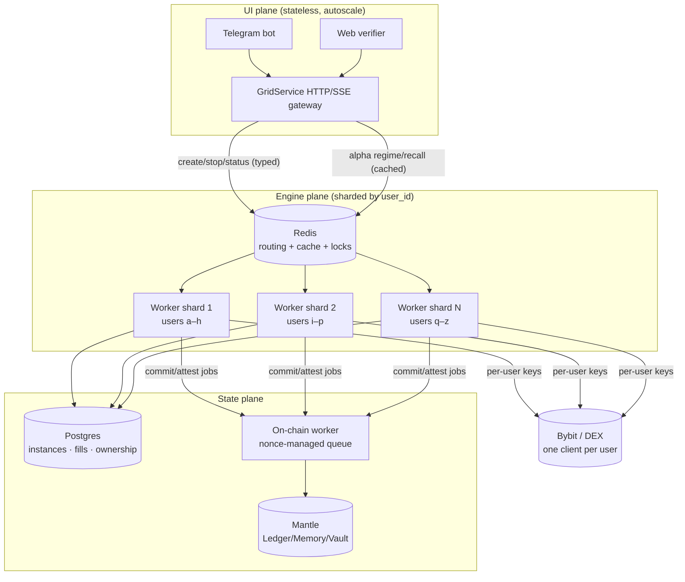

# Scaling — multi-tenant target

Goal: serve **30–100 users** at a sustained **~200 order-ops/sec** (grid fills →
paired orders, plus re-center bursts) while keeping the non-custodial promise
(each user trades on *their own* venue keys) and the verifiable loop
(commit → trade → attest on Mantle).

This doc is the structural plan. The per-process quick-wins that raise the
single-node ceiling first are tracked in [Phase 0](#phase-0--single-process-quick-wins-shipped).

---

## Why today's shape can't reach the target

The engine is excellent at running **one** grid. The product shape around it is
single-everything, and three of those are *hard* limits — they fail by design,
not by tuning:

| Limit | Where | Ceiling |
|------|-------|---------|
| One Bybit account for all users | `app/service.py` (`AppService` wraps one `exchange`) | ~10 order-ops/s **total**; breaks the non-custodial promise |
| One Mantle wallet, serial nonce, blocking receipt | `adapters/chain/client.py:_send_sync` | ~1 tx / 2–4 s; nonce races across concurrent launches |
| One asyncio process + SQLite single-writer | `runner.py`, `adapters/store/sqlite_store.py` | 1 core (GIL); no horizontal scale |

Plus: fill fan-out is O(N²) if engines share one WS stream
(`engine.py:consume` filters by `instance_id`), ownership (`_owner`) lives in RAM,
and the on-chain detail mirror rewrites a whole JSON file per write.

Full findings: see the audit in the PR description / commit history.

---

## Target architecture

Three planes, each scaled independently. The engine and agent **do not change** —
they already depend only on ports (`domain/ports.py`). What changes is *how many*
of them run and *who owns the singletons* (keys, wallet, DB).

Routing rule: `shard = hash(user_id) % N`. A user's grids always land on the same
worker, so one user = one `BybitExchange` = one private WS = no cross-user fan-out.

---

## Structural changes

### 6. Per-user exchange client (kills limits #1 and the O(N²) fan-out)
`AppService` holds `dict[user_id -> ExchangePort]`, built from that user's keys at
first `create_grid`. One private WS per user; `stream_fills` is consumed once and
routed to that user's engines by `instance_id` (no other user sees it). Rate
limits now **sum** across accounts: 100 users × ~10/s = ~1000 order-ops/s headroom.
- Touches: `app/service.py`, a `ClientRegistry`, engine consume wiring.
- Keep `ExchangePort` unchanged. The Bybit batch endpoint (Phase 0) means a
  re-center is 1–2 requests, so each user stays far under their own cap.

### 7. Nonce-managed on-chain worker (kills limit #2)
One signer, one **serialized** job queue, manual nonce allocation
(`get_transaction_count(pending)` once, then increment in-process), and
**fire-then-confirm** instead of blocking each launch on a receipt.
- `commit_strategy` must still happen **before** trading — so the *commit* job is
  awaited, but `attest`/`write_memory` are enqueued and confirmed asynchronously.
- For throughput beyond one signer: a small **pool of platform wallets**, each
  with its own nonce lane; jobs hash-partitioned across them.
- Touches: `adapters/chain/client.py` (extract a `NonceManager` + queue),
  `agent/loop.py` (await commit, enqueue attest/learn).

### 8. Durable ownership + instance state → Postgres (kills limit #3, part 1)
`_owner` and recovery move behind `StorePort` on Postgres (the port already
exists; `sqlite_store.py` documents the upgrade path). Workers are then
stateless-on-restart: any shard can rebuild its users' grids from the DB.
- Touches: new `PostgresStore(StorePort)`, `AppService` ownership reads/writes.

### 9. Detail mirror + caches → Redis (removes the JSON-rewrite + stampede)
Replace the whole-file `_DetailMirror.write_text` with atomic Redis writes, and
move the alpha API's `TTLCache` (Phase 0) to Redis so it's shared across UI
replicas. recall results cached per `regimeKey`.
- Touches: `adapters/chain/client.py` (`_DetailMirror`), `app/cache.py` (Redis backend).

### 10. Shard the engine plane (kills limit #3, part 2)
Run N worker processes (one event loop each → N cores). Route by `user_id` via
Redis. A worker owns its users' engines, WS streams, and exchange clients. This is
the lever that turns "1 core" into linear horizontal scale.
- Touches: deploy topology, a thin router; engine/agent code unchanged.

### 11. Separate the money path from the hot path
On-chain confirmation, x402 settlement, and fills persistence are decoupled from
order placement so a slow Mantle block never stalls a fill→paired-order. Persist
fill (Postgres, durable) → place paired order; enqueue attest/learn out-of-band.

---

## Capacity math (how 200/s is actually met)

- **Execution:** per-user accounts + batch create. 1 user ≈ 200 orders/s (10
  req/s × 20 per batch); 100 users → far past 200/s aggregate. ✅
- **Persistence:** Postgres handles thousands of small inserts/s; per-user fills
  are independent rows. ✅
- **On-chain:** *not* on the 200/s trade path — it's per *episode* (launch/close),
  measured in launches/minute. The nonce queue (+ wallet pool) absorbs bursts. ✅
- **CPU:** N worker processes = N cores; signing/JSON/Decimal spread across shards. ✅

The binding constraint moves from "one account" to "how many worker cores +
platform wallets we provision" — a scaling dial, not a wall.

---

## Migration phases (each ships green)

### Phase 0 — single-process quick-wins (SHIPPED)
Raises the single-node ceiling from ~10 to tens of order-ops/s; no API changes.
- Bybit **batch** create + **rate limiter** + **retry/backoff** (no more silent order drops).
- SQLite **WAL** + `synchronous=NORMAL` (≈10× faster commits, still durable).
- Signal fan-out **parallelized** (`asyncio.gather`) + reused HTTP sessions.
- Alpha API **TTL cache** for regime/recall.
- All tunable via `Settings` (`bybit_rate_limit`, `bybit_max_retries`, `alpha_cache_ttl_s`).

### Phase 1 — multi-tenant, single node
Per-user exchange clients (#6) + Postgres ownership/state (#8). One process, but
correct isolation and durable multi-user. Unblocks the Telegram product.

### Phase 2 — durable money path
Nonce-managed on-chain worker (#7) + Redis mirror/cache (#9) + decoupled
persistence (#11).

### Phase 3 — horizontal shards
N workers routed by `user_id` (#10) + wallet pool. Linear scale to the target.

---

## Risks / open questions

- **Wallet pool funding & accounting** — N platform signers each need MNT for gas;
  attribution back to users via the Vault.
- **WS connection ceiling** — one private WS per user; Bybit caps connections per
  IP, so shards must spread across egress IPs at high user counts.
- **Exactly-once attest** — fire-then-confirm needs an idempotency key
  (`instance_id`) so a retry never double-attests.
- **Rebalance on shard add/remove** — consistent hashing or drain-and-migrate.
