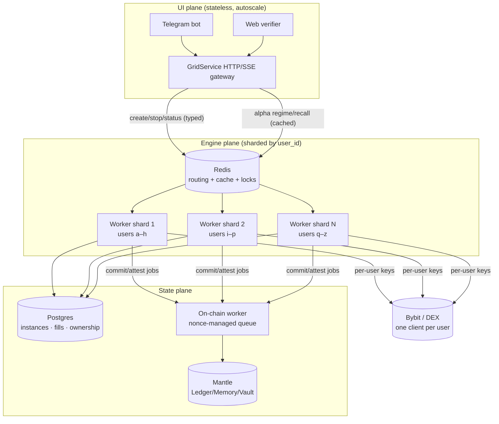

# Scaling — multi-tenant target

Goal: serve **30–100 users** at a sustained **~200 order-ops/sec** (grid fills →
paired orders, plus re-center bursts) while keeping the non-custodial promise
(each user trades on *their own* venue keys) and the verifiable loop
(commit → trade → attest on Mantle).

This doc is the structural plan. The per-process quick-wins that raise the
single-node ceiling first are tracked in [Phase 0](#phase-0--single-process-quick-wins-shipped).

---

## Why today's shape can't reach the target

The engine is excellent at running **one** grid. The product shape around it is
single-everything, and three of those are *hard* limits — they fail by design,
not by tuning:

| Limit | Where | Ceiling |
|------|-------|---------|
| One Bybit account for all users | `app/service.py` (`AppService` wraps one `exchange`) | ~10 order-ops/s **total**; breaks the non-custodial promise |
| One Mantle wallet, serial nonce, blocking receipt | `adapters/chain/client.py:_send_sync` | ~1 tx / 2–4 s; nonce races across concurrent launches |
| One asyncio process + SQLite single-writer | `runner.py`, `adapters/store/sqlite_store.py` | 1 core (GIL); no horizontal scale |

Plus: fill fan-out is O(N²) if engines share one WS stream
(`engine.py:consume` filters by `instance_id`), ownership (`_owner`) lives in RAM,
and the on-chain detail mirror rewrites a whole JSON file per write.

Full findings: see the audit in the PR description / commit history.

---

## Target architecture

Three planes, each scaled independently. The engine and agent **do not change** —
they already depend only on ports (`domain/ports.py`). What changes is *how many*
of them run and *who owns the singletons* (keys, wallet, DB).

Routing rule: `shard = hash(user_id) % N`. A user's grids always land on the same
worker, so one user = one `BybitExchange` = one private WS = no cross-user fan-out.

---

## Structural changes

### 6. Per-user exchange client (kills limits #1 and the O(N²) fan-out) — SHIPPED (in-process)
`AppService` holds one `UserSession` per user (`app/session.py`), each with its
own `ExchangePort` (built via an injected `client_factory(user_id)`, or a single
shared client in demo mode). One private fill stream per user, consumed **once**
and routed to that user's engines by `instance_id` — no other user sees it
(`GridManager.create(consume=False)` + the session router). Rate limits now **sum**
across accounts: 100 users × ~10/s = ~1000 order-ops/s headroom.
- Shipped: `app/service.py`, `app/session.py`, `app/manager.py` (consume flag).
- `ExchangePort` unchanged. The Bybit batch endpoint (Phase 0) means a re-center is
  1–2 requests, so each user stays far under their own cap.
- Still in-process: the **source of per-user keys** (a credentials store) and
  durable ownership are #8.

### 7. Nonce-managed on-chain worker (kills limit #2) — SHIPPED
`NonceManager` (`adapters/chain/nonce.py`): one signer seeds its nonce ONCE, then
hands out strictly increasing nonces under a lock — concurrent sends can't collide.
Submission no longer waits for a receipt, so txs **pipeline** (nonce N, N+1, …) and
confirm in parallel; throughput is bounded by block inclusion, not serial
round-trips. `commit_strategy`/`settle_fee` are **confirmed inline** (pre-commitment
/ money must land first); `attest`/`write_memory` are **fire-then-confirm** (return
on submit, confirm in the background, revert logged not raised). `client.drain()`
awaits in-flight confirmations on graceful shutdown.
- Shipped: `adapters/chain/nonce.py`, `adapters/chain/client.py`, `runner.py` drain.
- Beyond one signer: a **pool of wallets**, one `NonceManager` lane each, jobs
  hash-partitioned — same interface, drop-in.

### 8. Durable ownership + instance state → Postgres (kills limit #3, part 1) — SHIPPED
Ownership + recovery moved behind `StorePort`: instances carry a `user_id`,
`AppService.recover()` rebuilds every open grid under its owning user on startup
(replays PnL; no re-place — venue reconciliation is roadmap). Per-user venue keys
are sealed (`CredentialCodec`, Fernet) and stored as ciphertext, then turned back
into clients by `credential_client_factory`. The store is now selectable by DSN
(`postgres_dsn` → `PostgresStore`, else SQLite — identical surface).
- Shipped: `adapters/store/postgres_store.py`, `adapters/store/credentials.py`,
  `adapters/store/serde.py`, owner columns/methods in `sqlite_store.py`,
  `AppService.recover()` + async `client_factory`, `runner.py` store selection.
- Tested now via SQLite (recovery/ownership) + the crypto codec; `PostgresStore`
  SQL is integration-tested under `PERPSAGENT_TEST_PG_DSN` (skips without it).

### 9. Detail mirror + caches → Redis (removes the JSON-rewrite + stampede) — SHIPPED
`CachePort` (async) with two impls: `InProcessCache` (default) and `RedisCache`
(shared across UI replicas — so a request burst hits one cache, not N). The alpha
API caches response BODIES (JSON), so the same port works in-process or on Redis;
selected by `redis_url`. The detail mirror's whole-file `write_text` is now an
**atomic** temp-write + rename (no half-written file on crash / concurrent read).
- Shipped: `app/cache.py`, `adapters/cache/redis_cache.py`, `app/alpha_api.py`
  (pluggable cache), atomic `_DetailMirror` in `adapters/chain/client.py`, `redis`
  extra + `docker compose` redis service. RedisCache integration-tested under
  `REDIS_URL` (skips without it).

### 10. Shard the engine plane (kills limit #3, part 2)
Run N worker processes (one event loop each → N cores). Route by `user_id` via
Redis. A worker owns its users' engines, WS streams, and exchange clients. This is
the lever that turns "1 core" into linear horizontal scale.
- Touches: deploy topology, a thin router; engine/agent code unchanged.

### 11. Separate the money path from the hot path
On-chain confirmation, x402 settlement, and fills persistence are decoupled from
order placement so a slow Mantle block never stalls a fill→paired-order. Persist
fill (Postgres, durable) → place paired order; enqueue attest/learn out-of-band.

---

## Capacity math (how 200/s is actually met)

- **Execution:** per-user accounts + batch create. 1 user ≈ 200 orders/s (10
  req/s × 20 per batch); 100 users → far past 200/s aggregate. ✅
- **Persistence:** Postgres handles thousands of small inserts/s; per-user fills
  are independent rows. ✅
- **On-chain:** *not* on the 200/s trade path — it's per *episode* (launch/close),
  measured in launches/minute. The nonce queue (+ wallet pool) absorbs bursts. ✅
- **CPU:** N worker processes = N cores; signing/JSON/Decimal spread across shards. ✅

The binding constraint moves from "one account" to "how many worker cores +
platform wallets we provision" — a scaling dial, not a wall.

---

## Migration phases (each ships green)

### Phase 0 — single-process quick-wins (SHIPPED)
Raises the single-node ceiling from ~10 to tens of order-ops/s; no API changes.
- Bybit **batch** create + **rate limiter** + **retry/backoff** (no more silent order drops).
- SQLite **WAL** + `synchronous=NORMAL` (≈10× faster commits, still durable).
- Signal fan-out **parallelized** (`asyncio.gather`) + reused HTTP sessions.
- Alpha API **TTL cache** for regime/recall.
- All tunable via `Settings` (`bybit_rate_limit`, `bybit_max_retries`, `alpha_cache_ttl_s`).

### Phase 1a — per-user sessions (SHIPPED)
Per-user exchange clients + single-consumer fill routing (#6), in-process. One
process, but correct capital/fill isolation and ownership by session boundary.
`AppService` is now genuinely multi-user — unblocks the Telegram product on a
single node.

### Phase 1b — durable multi-tenant (SHIPPED)
Postgres ownership/state (#8): persist `user_id → instances → fills` + encrypted
per-user keys, so a worker rebuilds its users' grids after a restart
(`AppService.recover()`). `PostgresStore` is the production backend; SQLite remains
a valid local backend behind the same port. Deps added under the `postgres` extra.

### Phase 2a — nonce-managed on-chain worker (SHIPPED)
Race-free, pipelined on-chain writes (#7): commit/settle confirmed inline,
attest/memory fire-then-confirm. Kills the wallet-nonce hard limit on a single
signer; a wallet pool extends it linearly.

### Phase 2b — shared cache + decoupled persistence (SHIPPED)
Redis-backed alpha cache behind `CachePort` (#9) + atomic detail-mirror writes.
Decoupled persistence (#11) is substantially in place from prior phases: fills are
persisted durably before the paired order (Phase 1b store) and on-chain writes are
fire-then-confirm (Phase 2a), so neither blocks the hot path. RedisCache validated
against a real Redis via `docker compose`.

### Phase 3 — horizontal shards
N workers routed by `user_id` (#10) + wallet pool. Linear scale to the target.

---

## Risks / open questions

- **Wallet pool funding & accounting** — N platform signers each need MNT for gas;
  attribution back to users via the Vault.
- **WS connection ceiling** — one private WS per user; Bybit caps connections per
  IP, so shards must spread across egress IPs at high user counts.
- **Exactly-once attest** — fire-then-confirm needs an idempotency key
  (`instance_id`) so a retry never double-attests.
- **Rebalance on shard add/remove** — consistent hashing or drain-and-migrate.
- **Credential master key** (`PERPSAGENT_CRED_MASTER_KEY`) — rotation + backup;
  losing it makes every stored user key unrecoverable. Never log/commit it; a real
  deploy moves it to a KMS/secret manager.
